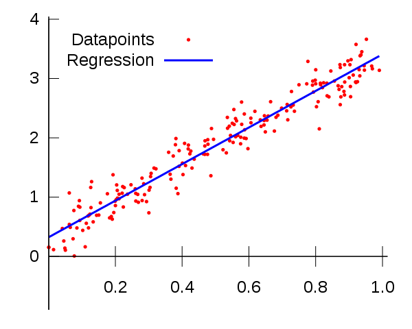

# Linear Regression from scratch

In this repository you can find linear regression written in numpy from scratch based on linear algebra. It's one of the most basic problems in machine learning. According to some data and target points, we are creating a line with which we are going to predict new values.





## Getting Started   

To run it You need jupyter notebook installed or You can run it using [google colab](https://colab.research.google.com).

The main file is [LinearRegression.ipynb](LinearRegression.ipynb) 

### Prerequisites
```
-numpy
-matplotlib
```

## Author

* [Sohaib1424](https://github.com/Sohaib1424)
